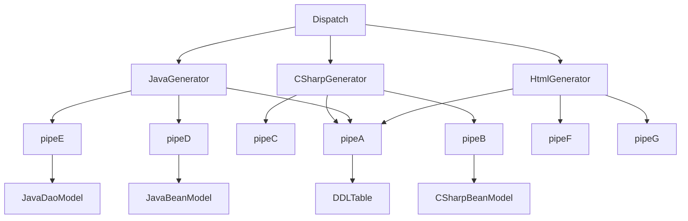
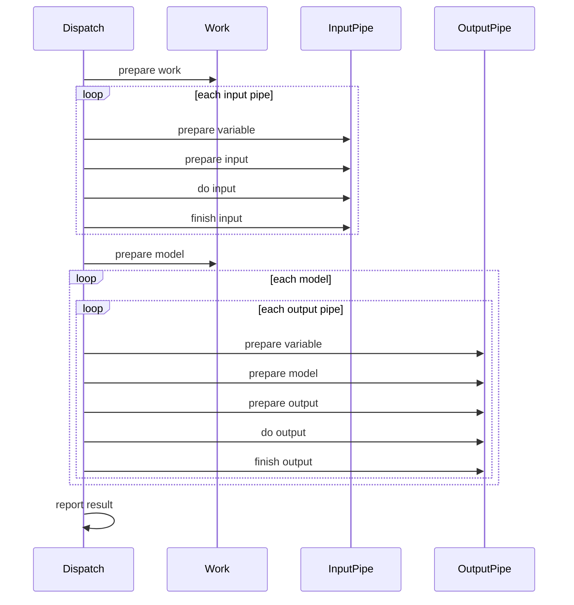

## 结构

<!-- https://mermaid.js.org/intro/ --->

## 模型
* 实体模型
* 数据库模型
* 界面模型

## 流水线
1. 每种流水线对应某种模型
2. 流水线状态无关
3. Dispatch每次调用流水线处理一个对应的模型还是把所有对应的模型都处理掉？   
   决定：每次调用流水线处理一个对应的模型
   理由：方便流水线之间衔接情况的出现。

## 箱子Box
### 作用
- 将来支持pipe之间的衔接
- 流水线状态无关

## 流程

